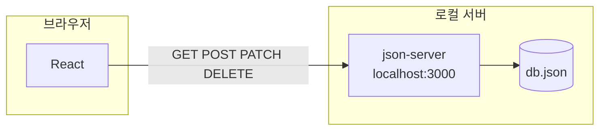
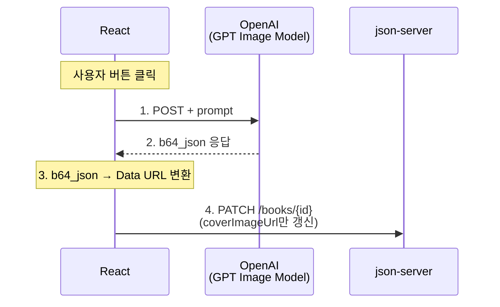

# AI 표지 생성을 지원하는 도서관리 시스템 (Frontend)

**React + fetch + CRUD**를 실제 프로젝트에 적용, 외부 API(**OpenAI**) 연동

> 백엔드는 `json-server`로 대체, 이후 Backend Mini-Project에서 **Spring Boot**로 교체할 예정

---

## 팀 멤버 및 R&R

| 역할 | 담당 |
| --- | --- |
| 조장 / PM, 기획 | 홍수현 |
| 발표자 / UI, 레이아웃 | 최현준 |
| CRUD 연동 | 오희주, 강민욱 |
| OpenAI 연동 | 정무영 |
| 스타일링, QA | 이휘 |
| 발표자료, 문서 | 조영웅 |

---

## 학습 목표

- 강의에서 학습한 **React + fetch + CRUD** 개념을 실제 프로젝트에 적용
- 외부 API(**OpenAI**) 연동 경험 확보

---

## 기술 스택

| 구분 | 기술 |
| --- | --- |
| **Frontend** | React 19, Vite, fetch (네이티브 API) |
| **Data (Mock Backend)** | json-server (로컬 REST API) |
| **AI 연동** | OpenAI API (GPT Image 모델 — 표지 생성) |
| **협업·배포** | GitHub, Vercel (선택) |

---

## 프로젝트 구성도

### CRUD — 도서 데이터 관리

- **Frontend:** React(브라우저)에서 REST API 호출 (`GET`, `POST`, `PATCH`, `DELETE`)
- **Mock Backend:** `json-server` (`localhost:3000`)
- **저장소:** `db.json`

### AI — 표지 자동 생성

1. React에서 사용자가 표지 생성 버튼 클릭
2. `prompt`와 함께 OpenAI(GPT Image Model)에 `POST` 요청
3. 응답의 `b64_json`을 Data URL로 변환
4. `PATCH /books/{id}`로 `coverImageUrl`만 json-server에 저장

---

## API 엔드포인트 (json-server 기준)

| 구분 | 서비스명 | API 이름 | Method | REST API |
| --- | --- | --- | --- | --- |
| 조회 | BookList | 목록 조회 | GET | `/books` |
| 등록 | BookCreate | 도서 등록 | POST | `/books` |
| 수정 | BookUpdate | 도서 수정 | PATCH | `/books/{id}` |
| 삭제 | BookDelete | 도서 삭제 | DELETE | `/books/{id}` |
| 조회 | BookDetail | 도서 상세 조회 | GET | `/books/{id}` |
